# Guia de Instalação do Cloud Pak for Data v5.0.3

### Este documento tem como objetivo demonstrar como foi executada a instalação Cloud Pak for Data e instancias do Watson Studio, SPSS, Cognos e OpenScale

## Pré-requisitos:
 - Ter um cluster OpenShift v4.14 ou superior.
 - Possuir ``Entitlement Key``
 - Binário ``cpd-cli`` para as variáveis de ambiente.

## Preparar o ambiente:
### Para preparar os ambiente, será necessário configurar o cluster OpenShift no TechZone:
- Acesse: https://techzone.ibm.com/collection/5fb3200cec8dd00017c57f20
- Vá até **VMware on IBM Cloud Environments**
- Ao abrir a próxima página, selecione a imagem TechZone **OpenShift Cluster (VMWare on IBM Cloud)**.
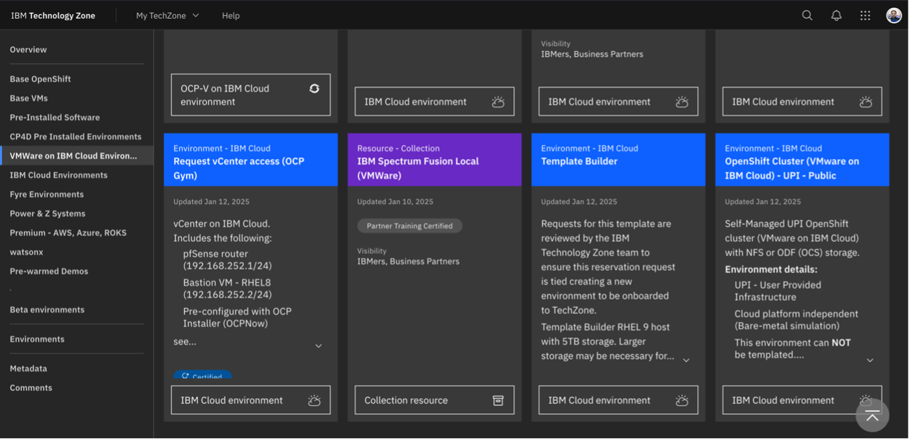

## Configurações da reserva:
Nas configurações da reserva do seu cluster, é necessário escolher a versão do OpenShift, o número de workers, Storage, CPU necessária e tamanho do disco; Deixe o as configurações como na imagem a seguir:
- **OpenShift Version:** ``v4.14``
- **Worker Node Count:** ``5`` (cinco worker nodes)
- **Worker Node Flavor:**
    + ``32 vCPU x 128 GB - 300 GB ephemeral storage``
- **Storage:** ``5 TB``(aqui provisionamos o storage para os storage nodes)
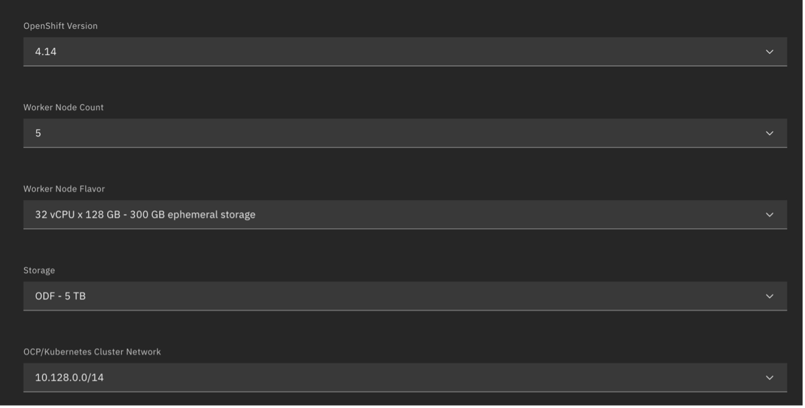
- Provisione o cluster e espere a reserva estar pronta.

## Login OpenShift Console
 Para fazer login no **Openshift Console**, é necessário de usuário **kubeadmin** e a senha, para isso acesse o sua imagem techzone, clique na **URL do Console** e use as credenciais a seguir  **(username e Password)** para fazer login:
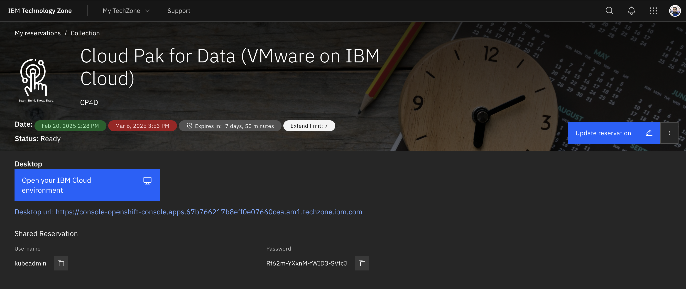

#### Após isso, faça login com as credenciais copiadas para acessar o Console OpenShift:
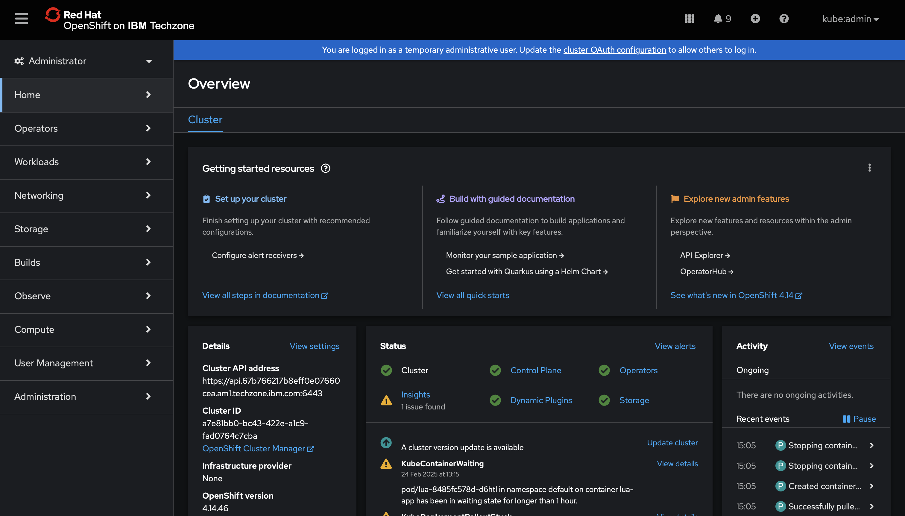

## Instalação do Cloud Pak for Data via Bastion

 A máquina ``Bastion`` é amplamente utilizada para instalações Air-Gap de Cloud Paks, Esse tipo de instalação é necessário porque o ambiente **não tem acesso direto à internet**. A máquina Bastion serve como um ponto intermediário para baixar imagens e pacotes necessários, que depois são transferidos para o cluster OpenShift.

##### Para conseguir fazer o login, é necessário obter essas credenciais que há na imagem do **TechZone** do  cluster OpenShift provisionado:

- Bastion SSH connection
- Bastion Password
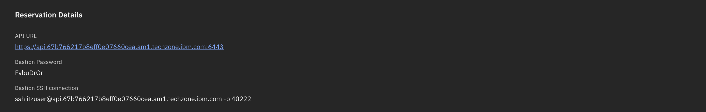

1 - Vá até o terminal e faça login SSH com as credenciais obtidas:
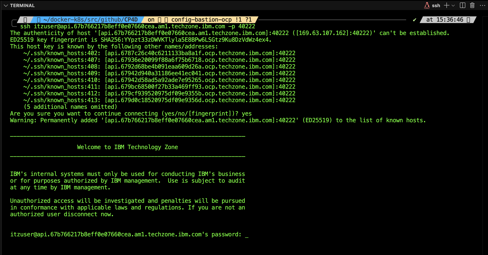

  Por default, logamos inicialmente com o usuário ``itzuser`` que tem as permissões necessárias para conseguirmos instalar o Cloud Pak for Data, não necessitando de permissões root.

 ## Configuração do Cluster OpenShift
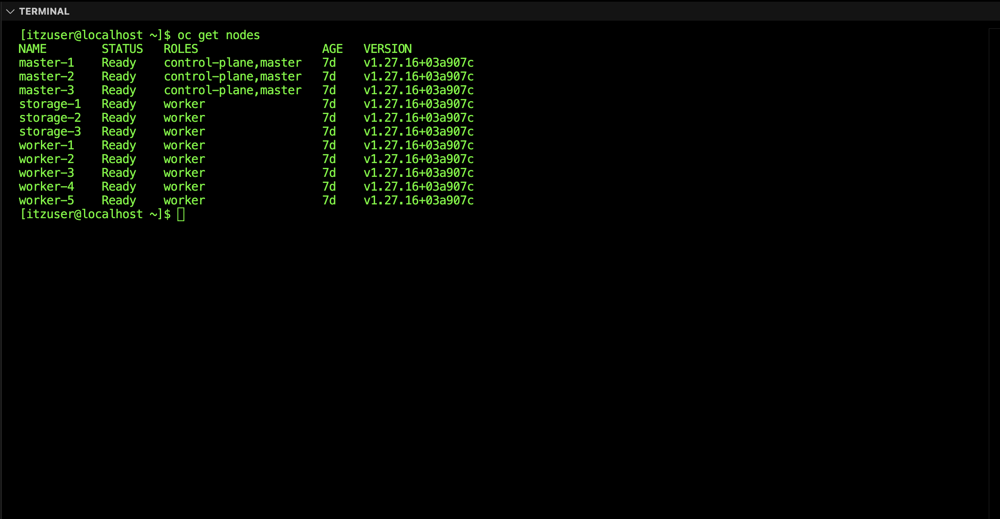

  Nosso cluster possui 3 **control-planes/master-nodes** que são responsáveis pela orquestração e gerenciamento do cluster.
 
 - Api Server (**kube-apiserver**) -> responsável por processar solicitações da API.
 - Controller Manager (**kube-controller-manager**) -> gerencia estados desejados dos objetos do cluster.
 - Scheduler (**kube-scheduler**) –> decide em quais nós os Pods serão executados.
 - ETCD – armazena todos os dados de estado do cluster.
 
   Os **workers** por sua vez, são responsáveis por executar cargas de trabalho, é onde instalamos e configuramos os **Pods, Deployments e Services** do **Cloud Pak for Data**.

 Já os **storages**, foram designados para atuar como nós de armazenamento, pois o ``OpenShift Data Foundation (ODF)`` precisa de nós dedicados para armazenar e gerenciar volumes persistentes.

## Instalando a interface da linha de comandos do IBM Cloud Pak for Data **(cpd-cli)**

 Para instalar o software IBM Cloud Pak for Data em seu cluster **RedHat® OpenShift® Container Platform**, deve-se instalar a Cloud Pak for Data interface da linha de comandos ``(cpd-cli)`` na estação de trabalho a partir da qual você está executando os comandos de instalação. 

#### Baixe a versão ``14.0.3`` do cpd-cli do repositório **IBM/cpd-cli** em GitHub. 
 Assegure-se de fazer download do pacote correto com base na licença do Cloud Pak for Data que você comprou e no sistema operacional na estação de trabalho do cliente: 
- Baixe a versão **Enterprise Edition**:
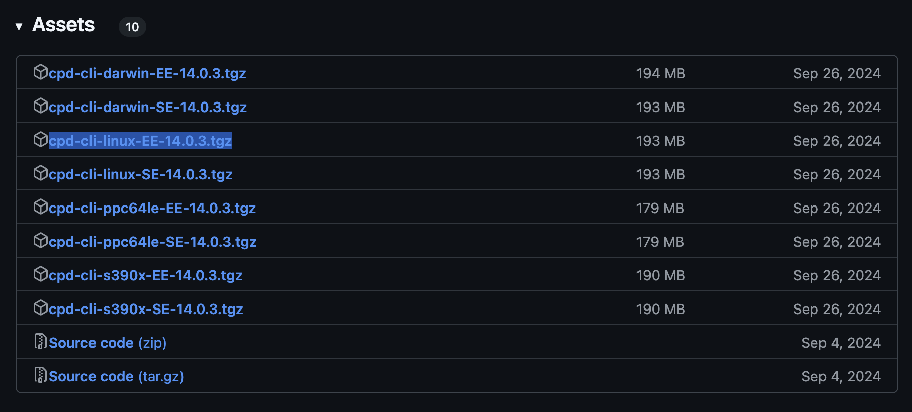

- Extraia o conteúdo do arquivo:
```
tar -xzvf cpd-cli-linux-EE-14.0.3.tgz
```
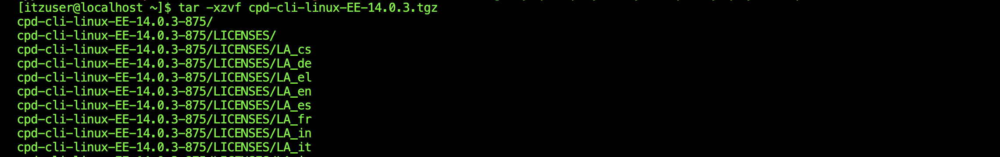
- Entre dentro do diretório e de comandos ilimitados de execução ao arquivo **cpd-cli**:
```
cd cpd-cli-linux-EE-14.0.3-875/
```

```
chmod 777 cpd-cli
```

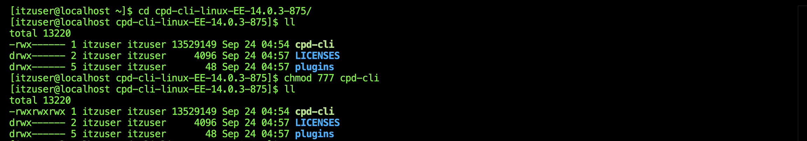

## Instalação e configuração do Podman

```
sudo yum install podman
```

```
sudo sysctl user.max_user_namespaces=15000
```

```
sudo usermod --add-subuids 200000-201000 --add-subgids 200000-201000 $(whoami)
```

```
grep $(whoami) /etc/subuid /etc/subgid
```

```
podman version
```
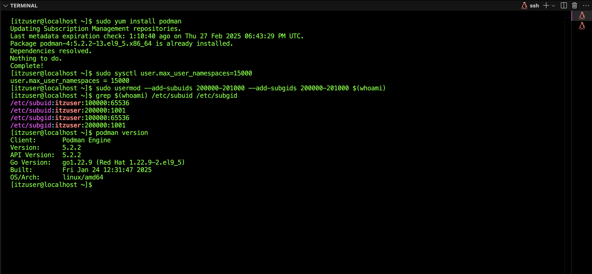

## Infra-nodes Rotulagem e taint para nós/nodes do OpenShift

Os nós precisam ser rotulados para identificar suas funções dentro do cluster **OpenShift**. Os comandos abaixo rotulam os nós ``storage-1`` ``storage-2`` e ``storage-3`` como nós de infraestrutura e armazenamento **OpenShift Data Foundation (ODF)**.

### Comandos de Rotulagem e Taint para Nós no **OpenShift**

Rotulando o node **storage-1** para infraestrutura e armazenamento.

```
oc label node storage-1 node-role.kubernetes.io/infra=""
```
```
oc label node storage-1 cluster.ocs.openshift.io/openshiftstorage=""
```

Rotulando o node **storage-2** para infraestrutura e armazenamento.

```
oc label node storage-2 node-role.kubernetes.io/infra=""
```

```
oc label node storage-2 cluster.ocs.openshift.io/openshiftstorage=""
```

Rotulando o node **storage-3** para infraestrutura e armazenamento.

```
oc label node storage-3 node-role.kubernetes.io/infra=""
```

```
oc label node storage-3 cluster.ocs.openshift.io/openshiftstorage=""
```
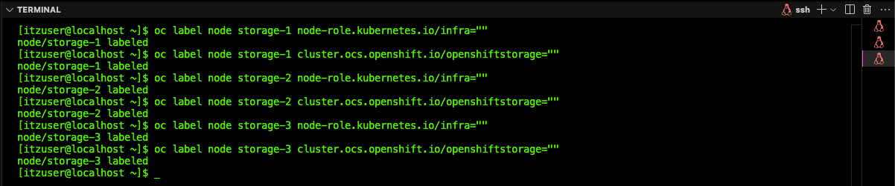

## Aplicando Taints aos Nós para Controlar Agendamento de Pods 

Em seguida, aplicamos taints aos nós para que somente workloads de armazenamento (como OpenShift Data Foundation) possam ser agendados neles. Os comandos a seguir adicionam a taint de armazenamento nos nós.

Aplicando taint ao node **storage-1** para armazenamento.

```
oc adm taint node storage-1 node.ocs.openshift.io/storage="true":NoSchedule
```

Aplicando taint ao node **storage-2** para armazenamento.

```
oc adm taint node storage-2 node.ocs.openshift.io/storage="true":NoSchedule
```

Aplicando taint ao node **storage-3** para armazenamento.

```
oc adm taint node storage-3 node.ocs.openshift.io/storage="true":NoSchedule
```
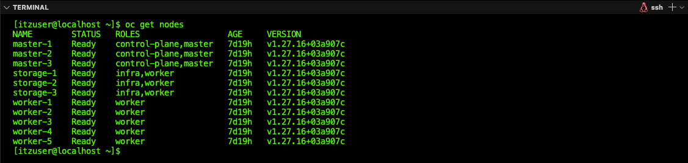

## Obtendo a sua chave API de autorização IBM para o IBM Cloud Pak for Data
- Para obter a sua ``Entitlement Key:``
    - Efetue login na **biblioteca de software no My IBM com o IBMid** (https://myibm.ibm.com/products-services/containerlibrary).
    - Na guia Chaves de direito, selecione Copiar para copiar a chave de direito para a área de transferência. 


## Configuração de variáveis de ambiente ambiente de instalação - (cpd_vars.sh)

Os comandos para instalar e fazer upgrade do **IBM Cloud Pak for Data** usam variáveis com o formato ``${VARIABLE_NAME}``. Você pode criar um script para exportar automaticamente os valores apropriados como variáveis de ambiente antes de executar os comandos de instalação. Depois de originar o script, você poderá copiar a maioria dos comandos de instalação e atualização da documentação e executá-los sem fazer alterações.

```
#===============================================================================
# Cloud Pak for Data installation variables
#===============================================================================

# ------------------------------------------------------------------------------
# Client workstation
# ------------------------------------------------------------------------------
# Set the following variables if you want to override the default behavior of the Cloud Pak for Data CLI.
#
# To export these variables, you must uncomment each command in this section.

# export CPD_CLI_MANAGE_WORKSPACE=<enter a fully qualified directory>
# export OLM_UTILS_LAUNCH_ARGS=<enter launch arguments>


# ------------------------------------------------------------------------------
# Cluster
# ------------------------------------------------------------------------------

export OCP_URL=https://api.6792d68be4b091eaa609d26a.ocp.techzone.ibm.com:6443
export OPENSHIFT_TYPE=self-managed
export IMAGE_ARCH=amd64
export OCP_USERNAME=kubeadmin
export OCP_PASSWORD=<password to your OCP>
# export OCP_TOKEN=<enter your token>
export SERVER_ARGUMENTS="--server=${OCP_URL}"
export LOGIN_ARGUMENTS="--username=${OCP_USERNAME} --password=${OCP_PASSWORD}"
# export LOGIN_ARGUMENTS="--token=${OCP_TOKEN}"
export CPDM_OC_LOGIN="cpd-cli manage login-to-ocp ${SERVER_ARGUMENTS} ${LOGIN_ARGUMENTS}"
export OC_LOGIN="oc login ${SERVER_ARGUMENTS} ${LOGIN_ARGUMENTS}"


# ------------------------------------------------------------------------------
# Proxy server
# ------------------------------------------------------------------------------

# export PROXY_HOST=<enter your proxy server hostname>
# export PROXY_PORT=<enter your proxy server port number>
# export PROXY_USER=<enter your proxy server username>
# export PROXY_PASSWORD=<enter your proxy server password>


# ------------------------------------------------------------------------------
# Projects
# ------------------------------------------------------------------------------

export PROJECT_CERT_MANAGER=ibm-cert-manager
export PROJECT_LICENSE_SERVICE=ibm-licensing
# export PROJECT_SCHEDULING_SERVICE=<enter your scheduling service project>
# export PROJECT_IBM_EVENTS=<enter your IBM Events Operator project>
export PROJECT_PRIVILEGED_MONITORING_SERVICE=ibm-cpd-privileged
export PROJECT_CPD_INST_OPERATORS=ibm-operators
export PROJECT_CPD_INST_OPERANDS=ibm-cpd
# export PROJECT_CPD_INSTANCE_TETHERED=<enter your tethered project>
# export PROJECT_CPD_INSTANCE_TETHERED_LIST=<a comma-separated list of tethered projects>

# ------------------------------------------------------------------------------
# Storage
# ------------------------------------------------------------------------------

export STG_CLASS_BLOCK=ocs-storagecluster-ceph-rbd
export STG_CLASS_FILE=ocs-storagecluster-cephfs

# ------------------------------------------------------------------------------
# IBM Entitled Registry
# ------------------------------------------------------------------------------

export IBM_ENTITLEMENT_KEY=Entitlement Key>

# ------------------------------------------------------------------------------
# Private container registry
# ------------------------------------------------------------------------------
# Set the following variables if you mirror images to a private container registry.
#
# To export these variables, you must uncomment each command in this section.

# export PRIVATE_REGISTRY_LOCATION=<enter the location of your private container registry>
# export PRIVATE_REGISTRY_PUSH_USER=<enter the username of a user that can push to the registry>
# export PRIVATE_REGISTRY_PUSH_PASSWORD=<enter the password of the user that can push to the registry>
# export PRIVATE_REGISTRY_PULL_USER=<enter the username of a user that can pull from the registry>
# export PRIVATE_REGISTRY_PULL_PASSWORD=<enter the password of the user that can pull from the registry>

# ------------------------------------------------------------------------------
# Cloud Pak for Data version
# ------------------------------------------------------------------------------

export VERSION=5.0.3


# ------------------------------------------------------------------------------
# Components
# ------------------------------------------------------------------------------

export COMPONENTS=ibm-cert-manager,ibm-licensing,cpfs,cpd_platform
# export COMPONENTS_TO_SKIP=<component-ID-1>,<component-ID-2>


# ------------------------------------------------------------------------------
# watsonx Orchestrate
# ------------------------------------------------------------------------------
# export PROJECT_IBM_APP_CONNECT=<enter your IBM App Connect in containers project>
# export AC_CASE_VERSION=<version>
# export AC_CHANNEL_VERSION=<version>

```

- Salve o arquivo como um shell script. Por exemplo, salve o arquivo como ``cpd_vars.sh``.
- Confirme se o script não contém nenhum erro. Por exemplo, se você nomeou o script ``cpd_vars.sh``, execute:

```
bash ./cpd_vars.sh
```

- Forneça as variáveis de ambiente. Por exemplo, se você nomeou o script ``cpd_vars.sh``, execute:

```
chmod 777 cpd_vars.sh
```

```
source ./cpd_vars.sh
```

### Adicionando a interface de comando para o ``$PATH``

```
echo 'export PATH=/home/itzuser/cpd-cli-linux-EE-14.0.3-875:$PATH' >> ~/.bash_profile
```

```
echo 'source /home/itzuser/cpd-cli-linux-EE-14.0.3-875/cpd_vars.sh' >> ~/.bash_profile
```

```
source ~/.bash_profile
```
## Preparando o Cluster

#### Atualizando o segredo de extração de imagem global para IBM Cloud Pak for Data

O segredo de extração de imagem global assegura que seu cluster tenha as credenciais necessárias para extrair imagens. As credenciais que você adiciona ao segredo de pull da imagem global dependem de onde você deseja puxar imagens.

- Faça login no seu cluster **OpenShift** utilizando o **cpd-cli:**

```
${CPDM_OC_LOGIN}
```
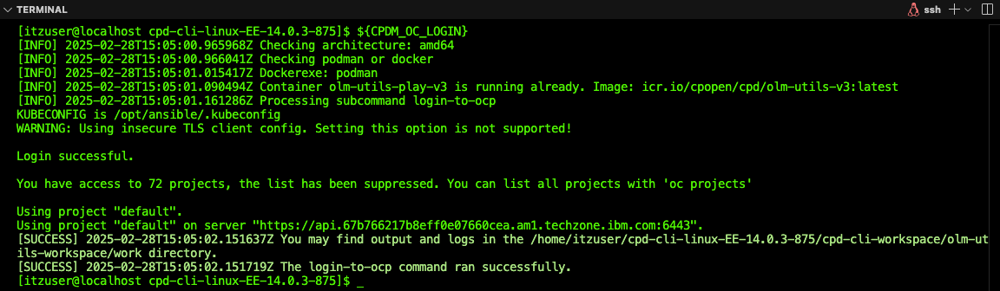

- Execute o comando a seguir para fornecer sua chave de API de autorização IBM para o segredo de pull de imagem global:

```
cpd-cli manage add-icr-cred-to-global-pull-secret \
--entitled_registry_key=${IBM_ENTITLEMENT_KEY}
```
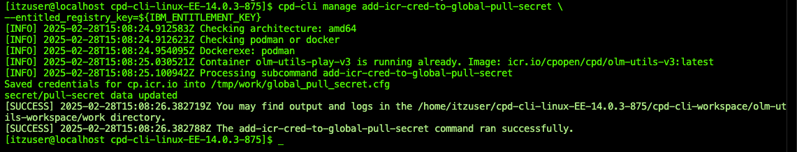

## Instalando componentes de cluster compartilhado para IBM Cloud Pak for Data

Antes de instalar o IBM Cloud Pak for Data, deve-se instalar o gerenciador de certificados e o serviço de licença do IBM Cloud Pak Foundational Services. Opcionalmente, é possível instalar o serviço de agendamento Cloud Pak for Data.

- Instale o Gerenciador de Certificados e o serviço de licença:

```
cpd-cli manage apply-cluster-components \
--release=${VERSION} \
--license_acceptance=true \
--cert_manager_ns=${PROJECT_CERT_MANAGER} \
--licensing_ns=${PROJECT_LICENSE_SERVICE}
```
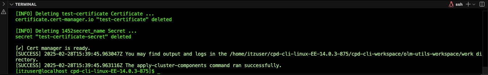

## Preparando para instalar uma instacia do Cloud Pak for Data

Antes de poder instalar o IBM Cloud Pak for Data, deve-se criar e configurar os projetos para uma instância do Cloud Pak for Data.

#### Aplicando permissões necessárias executando o comando ``authorize-instance-topology``

Antes de instalar uma instância do **IBM Cloud Pak for Data**, deve-se assegurar que o projeto no qual os operadores serão instalados possa observar o projeto no qual o plano de controle e os serviços estão instalados. É possível executar o comando authorize-instance-topology para aplicar as permissões necessárias aos projetos associados a uma instância do Cloud Pak for Data.

Execute o comando ``cpd-cli manage authorize-instace-topology`` para aplicar as permissões necessárias para os projetos.

```
cpd-cli manage authorize-instance-topology \
--cpd_operator_ns=${PROJECT_CPD_INST_OPERATORS} \
--cpd_instance_ns=${PROJECT_CPD_INST_OPERANDS}
```
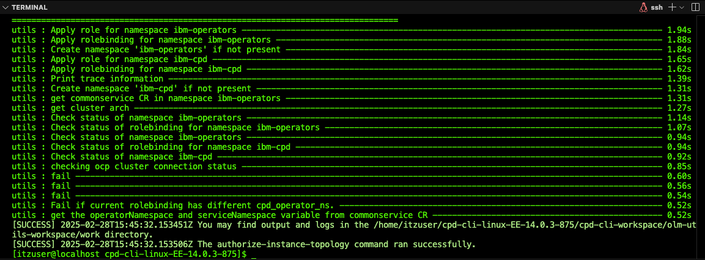

## Instalando uma instancia do Cloud Pak for Data

É possível instalar uma ou mais instâncias do **IBM Cloud Pak for Data** em seu cluster **Red Hat® OpenShift® Container Platform.** Cada instância do Cloud Pak for Data tem seu próprio projeto para operadores e seu próprio projeto para os recursos customizados para o plano de controle e serviços do Cloud Pak for Data (também chamados de operandos).

### Instalando o IBM Cloud Pak for Data foundational services

Antes de poder instalar o plano de controle do IBM Cloud Pak for Data, deve-se instalar os serviços fundamentais do IBM Cloud Pak que o Cloud Pak for Data requer. Cada instância do Cloud Pak for Data possui sua própria instância dos serviços fundamentais do IBM Cloud Pak.

Execute ``cpd-cli manage setup-instance-topology`` para instalar os serviços fundamentais do IBM Cloud Pak e criar o ``ConfigMap`` necessário:

```
cpd-cli manage setup-instance-topology \
--release=${VERSION} \
--cpd_operator_ns=${PROJECT_CPD_INST_OPERATORS} \
--cpd_instance_ns=${PROJECT_CPD_INST_OPERANDS} \
--license_acceptance=true \
--block_storage_class=${STG_CLASS_BLOCK}
```
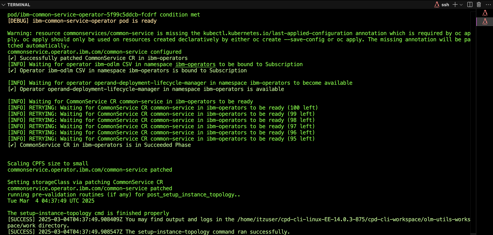


- Selecione o projeto ``ibm-operators``:

```
oc project ibm-operators
```


## Instalando o IBM Cloud Pak for Data Control Plane

Revise os termos de licença do software Cloud Pak for Data que você planeja instalar. As licenças estão disponíveis online. Execute os comandos apropriados com base no software que você planeja instalar:

- 1. IBM Cloud Pak for Data Enterprise Edition.
```
cpd-cli manage get-license \
--release=${VERSION} \
--license-type=EE
```
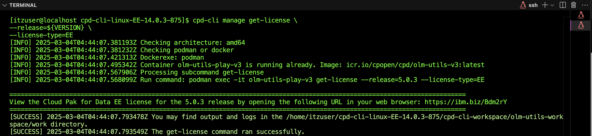

- 2. Instale o operators no operators projects para a instancia; Operador de plataforma e operadores de serviço do IBM Cloud Pak for Data:

```
cpd-cli manage apply-olm \
--release=${VERSION} \
--cpd_operator_ns=${PROJECT_CPD_INST_OPERATORS} \
--components=${COMPONENTS}
```
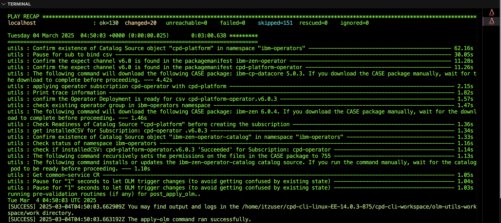

- 3. Instale o control plane no projeto de operandos da instância; ``Red Hat OpenShift Data Foundation storage``:

```
cpd-cli manage apply-cr \
--release=${VERSION} \
--cpd_instance_ns=${PROJECT_CPD_INST_OPERANDS} \
--components=cpd_platform \
--block_storage_class=${STG_CLASS_BLOCK} \
--file_storage_class=${STG_CLASS_FILE} \
--license_acceptance=true
```
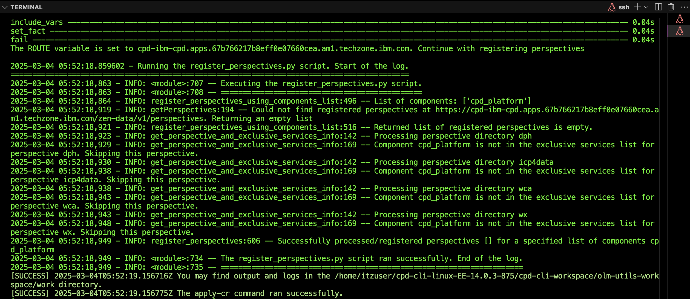

- 4. Confirme que o status dos operandos seja Concluído:

```
cpd-cli manage get-cr-status \
--cpd_instance_ns=${PROJECT_CPD_INST_OPERANDS} \
--components=cpd_platform
```
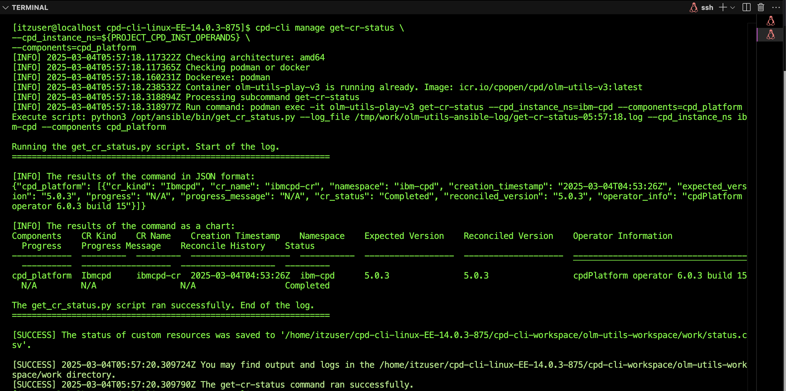

- 5.	Confirme que o status dos operandos seja Concluído:

```
cpd-cli manage get-cr-status \
--cpd_instance_ns=${PROJECT_CPD_INST_OPERANDS}
```
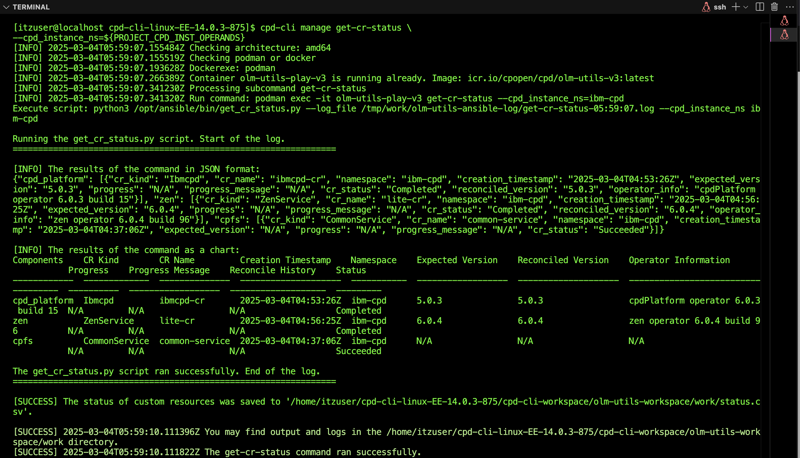

- 6.	Execute Ele segue os comandos ``cpd-cli`` para validar o funcionamento de sua implementação do ``Cloud Pak for Data``:

```
cpd-cli health operators \
--operator_ns=${PROJECT_CPD_INST_OPERATORS} \
--control_plane_ns=${PROJECT_CPD_INST_OPERANDS}
```
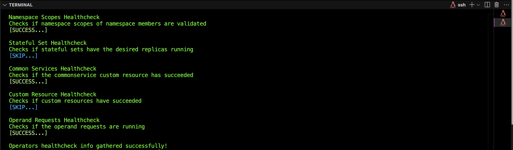


- 7.	Verifique a saúde dos recursos no projeto de operandos:

```
cpd-cli health operands \
--control_plane_ns=${PROJECT_CPD_INST_OPERANDS}
```
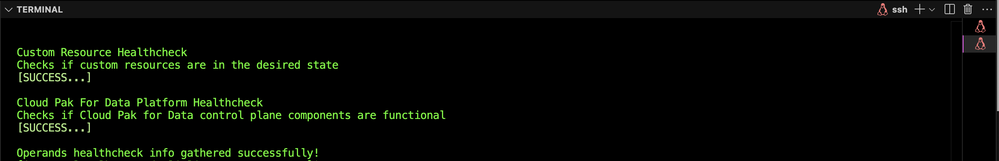

- 8.	Obtenha a ``URL`` a as credenciais do console Cloud Pak for Data:

```cpd-cli manage get-cpd-instance-details \
--cpd_instance_ns=${PROJECT_CPD_INST_OPERANDS} \
--get_admin_initial_credentials=true
```
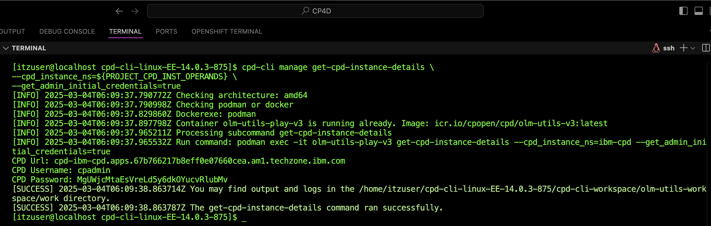

## Login Console Cloud Pak for Data

Pegue as credenciais (URL, username e password) e faça login no console do IBM Cloud Pak for Data:

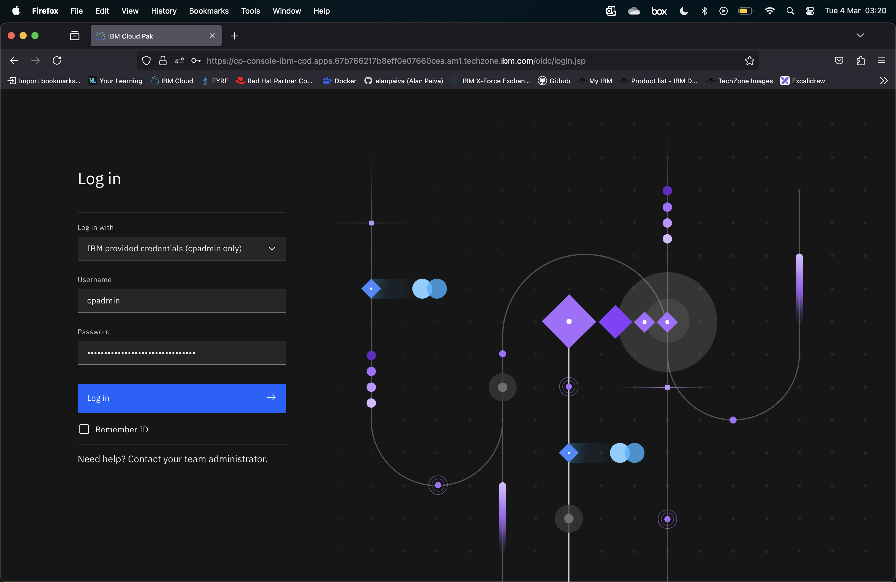

#### Home do Cloud Pak for Data:
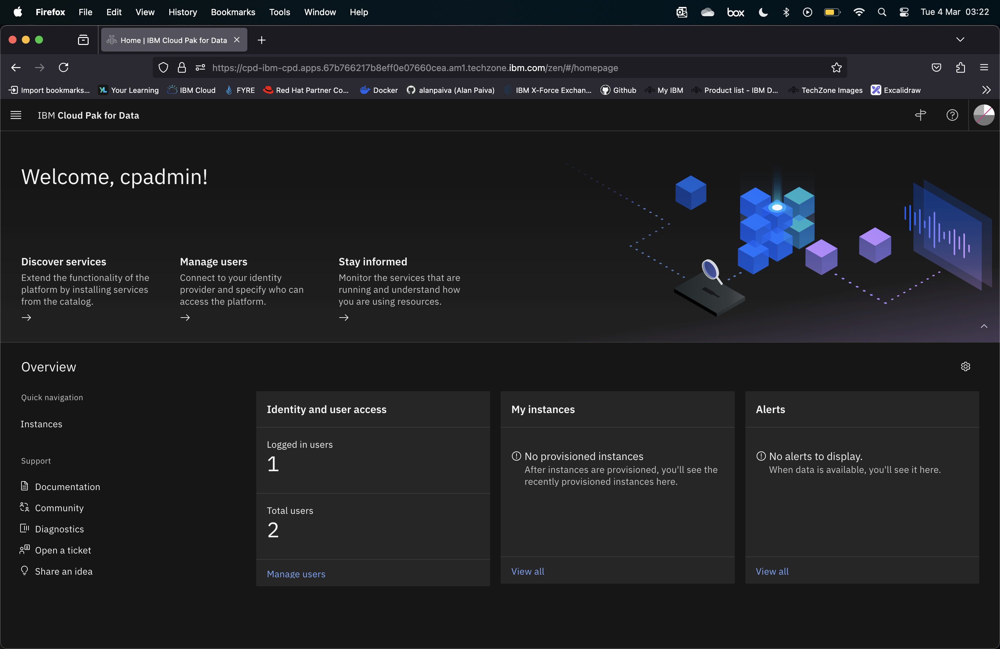

## Instalando a instancia do Watson Studio

A arquitetura do ``Watson Studio`` é centrada no projeto. Cientistas de dados e analistas de negócios usam projetos para organizar recursos e analisar dados.

Você pode ter estes tipos de recursos em um projeto:

- Colaboradores são as pessoas da equipe que trabalham com os dados.
- Os ativos de dados apontam para seus dados que estão em arquivos carregados ou acessados ​​por meio de conexões com fontes de dados.
- Ativos operacionais são os objetos que você cria, como scripts e modelos, para executar código nos dados.
- Ferramentas são o software que você usa para obter insights dos dados. Estas ferramentas estão incluídas no serviço ``Watson Studio``: 
  - ``Data Refinery``: prepare e visualize dados.
  - editor de Jupyter Notebook: Notebooks Code Jupyter.
  - Jupyter Lab IDE: codifique notebooks Jupyter e scripts ``Python`` com integração ``Git``. Outras ferramentas de projeto requerem serviços adicionais. Veja as listas de serviços complementares e relacionados.
  - ``Pipelines``: Automatize fluxos completos de dados ou modelos.

  ### Serviços Integrados

  
